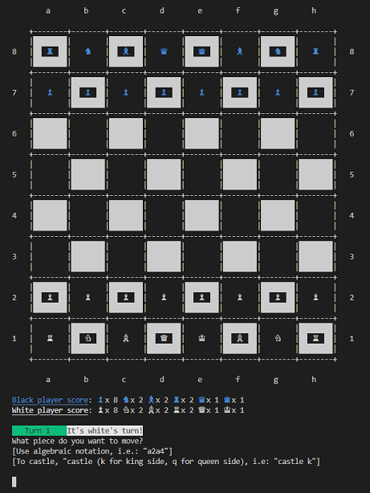

# Sapphire Chess v0.9.0

8""""8                                        
8      eeeee eeeee eeeee e   e e  eeeee  eeee 
8eeeee 8   8 8   8 8   8 8   8 8  8   8  8    
    88 8eee8 8eee8 8eee8 8eee8 8e 8eee8e 8eee 
e   88 88  8 88    88    88  8 88 88   8 88   
8eee88 88  8 88    88    88  8 88 88   8 88ee 
                                              
8""""8                                        
8    " e   e eeee eeeee eeeee                 
8e     8   8 8    8   " 8   "                 
88     8eee8 8eee 8eeee 8eeee                 
88   e 88  8 88      88    88                 
88eee8 88  8 88ee 8ee88 8ee88                
                                                 

Welcome to Sapphire Chess!

This is a chess game written in pure Ruby v2.7.5. Other versions have not been tested yet.

Please, visit https://medium.com/@lucas.sorribes/nostromo-my-ruby-chess-journey-part-i-7ef544b547a5 for a very detailed account of how I wrote this game.

---

## Current Features

* A beautiful board with easy-to-distinguish colors for white and black pieces.
* Fully functional AI
* Two game modes: human vs. computer, human vs. human.
* Three levels of difficulty.
* Full chess movement rules implementation, including castling and *en passant*, for both the human and the computer player.
* Accepts algebraic notation for movements, with human input validation.
* Material score display.
* Player's last move display.

## Screenshot

